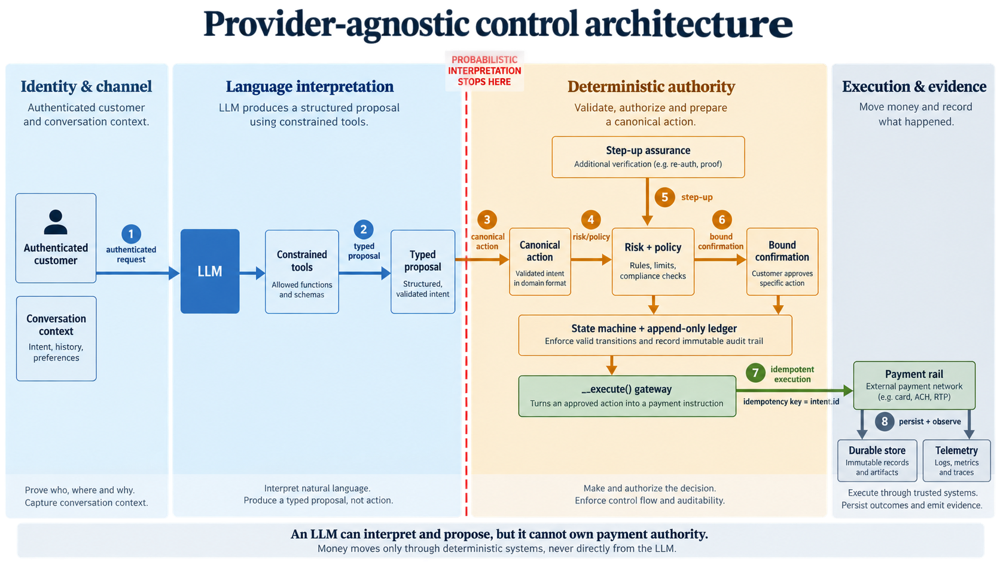
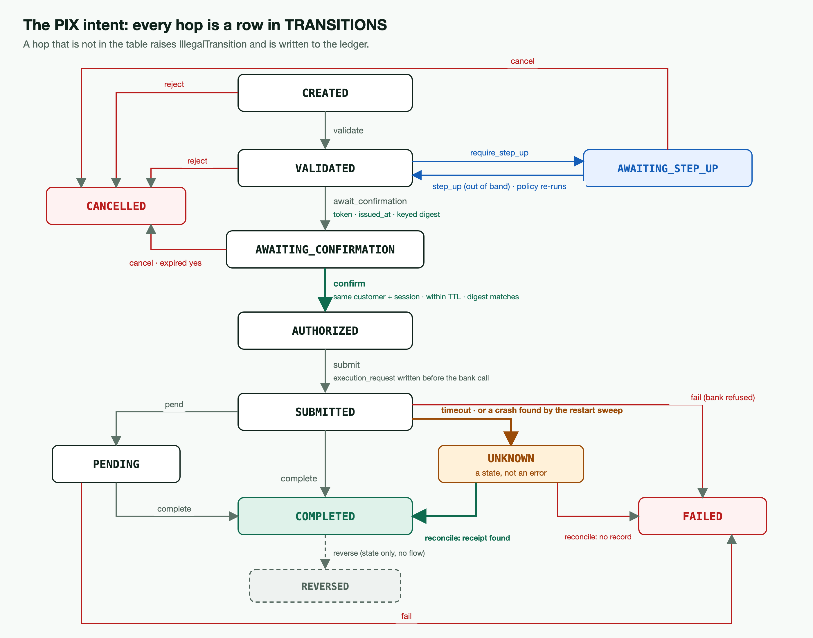
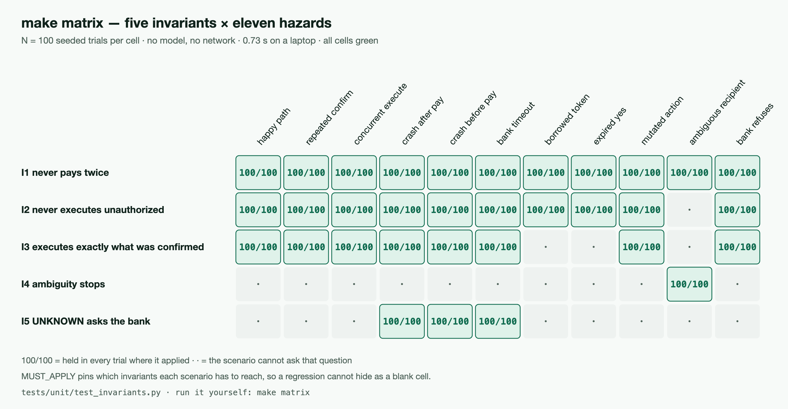
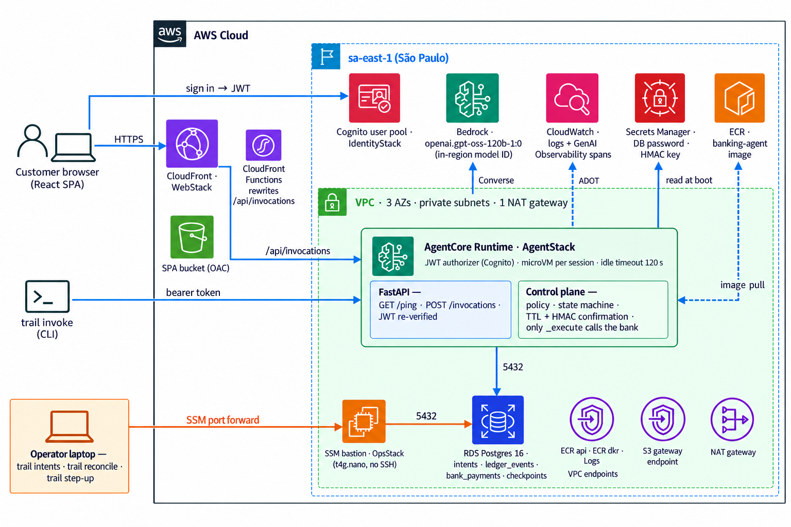

# Banking Agent Control Plane

**The model may interpret the request. It may not own the authority to move the money.**

An LLM banking assistant for Brazilian Pix transfers in which every sensitive action crosses a deterministic control plane. The model understands what the customer wants and *proposes* a typed action. Deterministic code then resolves it, checks preconditions, scores risk, evaluates policy, binds consent to one exact object, moves the intent through a state machine, executes through an idempotent gateway, and records an append-only ledger. That ledger can explain, after the fact, why money moved.

It runs locally in Docker Compose and on **Amazon Bedrock AgentCore Runtime** in `sa-east-1`, deployed with CDK.

<p>
  
  
  
  
  
</p>

> 📖 **Deep dive:** *The LLM Cannot Own the Money — building a control plane for an AI banking agent, from invariants to AgentCore* (Substack). <!-- ARTICLE_URL -->



```bash
git clone https://github.com/hualcosa/banking-agent-control-plane && cd banking-agent-control-plane
make test     # 436 unit tests with coverage — offline, no Docker, no credentials
make matrix   # five invariants × eleven hazards × 100 seeded trials, no model, under a second
```

---

## Contents

1. [The boundary](#1-the-boundary)
2. [The write path](#2-the-write-path)
3. [Failure: UNKNOWN, crashes and reconciliation](#3-failure-unknown-crashes-and-reconciliation)
4. [Evidence](#4-evidence)
5. [Running it locally](#5-running-it-locally)
6. [Running it on AWS](#6-running-it-on-aws)
7. [What is mocked, and what is not claimed](#7-what-is-mocked-and-what-is-not-claimed)
8. [TRAIL — the runtime underneath](#8-trail--the-runtime-underneath)
9. [Repository layout](#9-repository-layout)

---

## 1. The boundary

```
channel (web · CLI · AgentCore)   ← authenticates the customer; identity never comes from the model
        ↓
agent runtime (LLM + 7 tools)     ← understands, clarifies, PROPOSES a typed ProposedPix
        ↓
control plane                     ← resolves · validates · scores · decides · binds consent · executes · audits
        ↓  CreatePix + idempotency key
bank adapter (mocked)
```

Everything that decides lives in `src/control_plane/`: nine small modules, no agent framework, and no import of the runtime.

| Module | Owns | The one thing to read |
|---|---|---|
| `actions.py` | Typed actions, `Context`, capability registry | `ProposedPix` (what the agent may say) vs `CreatePix` (canonical; only the plane builds it) |
| `policy.py` | Mocked risk signals; ordered policy rules | `evaluate(…, now=…)`: first rule that applies decides, every verdict names its rule, the clock is injected |
| `state.py` | `Intent`, the state machine, the confirmation TTL, the action digest | `TRANSITIONS`: a hop not in the table raises and is recorded |
| `store.py` · `pgstore.py` | The `Store` protocol, `MemoryStore`, `PgStore` | `unsettled()`: the question a restart has to ask |
| `bank.py` · `pgbank.py` | The mock bank; its book of payments in Postgres | `create_pix(idempotency_key=…)`: same key twice, one payment |
| `pg_pool.py` | Tiny Postgres pools that check connections on checkout | why an idle AgentCore microVM needs that ([ADR 0004](docs/adr/0004-agentcore-runtime-sa-east-1.md)) |
| `plane.py` | `propose` · `step_up` · `confirm` · `cancel` · `reconcile` · `sweep` · `explain` | `_execute()`: the only place the bank is asked to move money |

The agent (`examples/banking/`) has seven tools: `get_balance`, `get_card_transactions`, `propose_pix`, `confirm_pix`, `cancel_pix`, `check_pix`, `explain_action`. Each is a thin call into the plane. **None can reach the bank, and none can grant assurance.** A tool the model could call to report "the customer approved in the app" would let a sentence stand in for an authentication factor, so step-up arrives out of band, from another process. The system prompt is short because the rules that matter are not in it; it makes the model a faithful relay of the `status` it receives.

## 2. The write path

```
"manda 300 pra Renata"
   ↓ agent → propose_pix(recipient="Renata", amount="300")
   ↓ plane:  resolve contact (exactly one, or REQUIRE_MORE_INFO)
             build CreatePix · check preconditions (funds, account)
             risk → policy → REQUIRE_CONFIRMATION + confirmation_id     state: AWAITING_CONFIRMATION
"Você vai enviar R$ 300,00 para Renata Silva. Confirma?"
"sim"
   ↓ agent → confirm_pix(confirmation_id)
   ↓ plane:  same customer AND same session? within the 5-minute TTL?
             does the action still match the keyed digest the token was issued for?
                                                        → AUTHORIZED → SUBMITTED
             bank.create_pix(idempotency_key=intent.id) → COMPLETED
"Feito. R$ 300,00 enviados para Renata Silva."
```

Three checks guard the confirmation, and each answers a different question.

- **Same principal.** A "yes" said in one conversation cannot be spent in another.
- **TTL.** A five-minute-old consent is not a weaker yes; it is not a yes. The intent is cancelled.
- **Keyed action digest.** An HMAC over the canonical action, keyed by `TRAIL_CONFIRMATION_SECRET`. If the action was rewritten after the customer agreed, the answer is refusal, recorded in the ledger. It is keyed rather than a bare hash, because anyone able to rewrite the action could recompute a plain hash.

Ownership is scoped by what an operation does ([ADR 0001](docs/adr/0001-ownership-by-operation.md)). `confirm` and `cancel` require customer + session. `step_up` and `reconcile` require customer + intent, because an app callback or an operator at 3am is not in the customer's chat. `explain` returns the trail only to whoever opened it, because the trail contains the confirmation token.

### The policy

| Condition | Verdict | Rule |
|---|---|---|
| amount > R$ 5.000 | `DENY` | `pix_hard_limit` (the institution's channel ceiling) |
| amount > R$ 1.000 between 20h and 06h **São Paulo time** | `DENY` | `pix_nighttime_limit` (Resolução BCB nº 142/2021) |
| amount > R$ 1.000, or risk `high`, and assurance < `strong` | `REQUIRE_STEP_UP_AUTH` | `pix_step_up` |
| every Pix | `REQUIRE_CONFIRMATION` | `capability_requires_confirmation` |

The nighttime rule reads the hour on a Brazilian clock and comes *before* the step-up demand: a denial reachable only after authenticating is a trap. Risk is mocked as three signals (`new_recipient`, `unusual_amount` > R$ 500, `untrusted_device`). Changing a limit is a code review, not a prompt edit. Note that the regulation caps the *aggregate* nighttime value; V0 enforces it per transaction.

## 3. Failure: UNKNOWN, crashes and reconciliation



- **`UNKNOWN` is a state, not an error.** A bank timeout after `SUBMITTED` means the money may or may not have moved. `reconcile` asks the bank by idempotency key and resolves to `COMPLETED` or `FAILED`. It never pays again.
- **Idempotency.** The key is `intent.id`. `execution_request` is written *before* the bank call and the receipt after, so a repeated confirm, or two workers executing the same authorized intent, produces one payment.
- **Restarting mid-payment.** A process that dies between those two writes leaves an intent in `SUBMITTED`. `ControlPlane.sweep()` runs at boot and moves it to `UNKNOWN` along the existing timeout edge, because a crash and a timeout leave identical evidence. `FaultyBank` (`tests/fakes.py`) raises an exception the plane does not catch, before or after the debit: crash-after-pay reconciles to `COMPLETED` with exactly one debit, and crash-before-pay reconciles to `FAILED` with none.
- **Operator commands** run outside the agent against the shared database, so they work when the agent is down. `docs/runbook.md` is the procedure.

| Command | For |
|---|---|
| `make intents` | list intents waiting on a person, each with the command that resolves it |
| `make reconcile INTENT=pix_abc123` | ask the bank what it did with one `UNKNOWN` intent |
| `trail step-up <intent_id>` | grant strong assurance from another process, then re-run policy |

**Identity comes from the channel.** Locally, it's a signed `X-Trail-Identity` header: HMAC, constant-time comparison, one 401 for every failure. On AWS it's a Cognito JWT that the Runtime authorizer checks *and* the process re-verifies against JWKS (`TRAIL_IDENTITY_MODE=jwt`). The customer id reaches the tools through LangGraph `configurable`, never as a tool argument. A conversation belongs to the customer who opened it, and someone else's thread is a 404 identical to one that never existed.

## 4. Evidence



**`make matrix`** runs `tests/unit/test_invariants.py`: five invariants (no double spend · no unauthorized execution · exactly the confirmed action · ambiguity stops · `UNKNOWN` asks the bank) against eleven scenarios, with 100 seeded trials per cell and no model. A failing trial prints its seed. Three rules keep the number honest:

- **Debits are counted, not inferred.** The mock bank is idempotent, so `len(bank.payments)` would assert the bank's guarantee and not the plane's.
- **A cell that does not apply prints `·`.**
- **`MUST_APPLY`** pins which invariants each scenario must reach, so a regression cannot hide as a blank cell.

The matrix was mutation-tested: six deliberate breaks of the plane, all of which now turn cells red. Three initially did not, and each exposed a defect in the instrument that was then fixed.

**Other tiers:**

| Command | What it proves | Needs |
|---|---|---|
| `make test` | 436 unit tests, coverage gate 90% (currently 97%) | nothing |
| `make matrix` | the five invariants under eleven hazards | nothing |
| `make test-integration` | 25 tests against the running stack: `PgStore`, `PgBank`, the HTTP service, an eval run | `make up` |
| `make eval` | agent behaviour with a real model: golden set `banking-v3`, 16 cases (5 adversarial, 3 multi-turn), pre-registered thresholds. **Reported separately, never labelled "invariant."** | `make up` + API key |

**[`docs/threat-model.md`](docs/threat-model.md)** maps 22 adversaries to invariants and named tests. Three are open gaps: A2 (injection through tool output has no gate; containment is structural), A11 (the model misreporting an outcome, measured only with the LLM tier), and A14 (the bank's receipt is not checked against the confirmed action).

**[`docs/adr/`](docs/adr/)** records the decisions that had a real alternative, each pointing at its evidence.

## 5. Running it locally

```bash
cp .env.example .env          # set TRAIL_LLM_API_KEY (any OpenAI-compatible provider, or Bedrock)
make up                       # agent, ui, postgres, and a self-hosted Langfuse
make chat                     # talk to the agent in the terminal, with the pipeline rail under each answer
make eval                     # the golden set and its scorecard
make test-integration         # the tier that needs the stack
```

| Surface | URL |
|---|---|
| Demo UI | http://localhost:5173 |
| Langfuse | http://localhost:3000 (`demo@trail.local` / `trail-demo-password`, printed by `make up`) |
| Agent OpenAPI | http://localhost:8000/docs |

Every thread endpoint needs a signed identity header, so `TRAIL_IDENTITY_SECRET` must be set (`.env.example` ships a demo value). The CLI signs its own. All `.env.example` credentials are local demo values; replace every one of them on any host that is not a laptop. Ports are overridable: `make up AGENT_PORT=8010 POSTGRES_PORT=55432 UI_PORT=5273`.

**Demo tripwires**, deliberate so the interesting paths are reachable from a chat:

- **Ana** matches two contacts → `REQUIRE_MORE_INFO`.
- **João** has never been paid, so > R$ 500 to him is high risk → step-up below the amount threshold. Grant it with `trail step-up <intent_id>`.
- A Pix over R$ 1.000 **after 20h São Paulo time** is refused by rule name.
- An amount ending in **,13** (e.g. `300,13`) is paid *and then* times out → `UNKNOWN`. Ask the assistant to check it, and it reconciles.
- The card has an **iFood R$ 129,00** charge dated yesterday.

## 6. Running it on AWS



`infra-cdk/` holds six CDK stacks in `sa-east-1`: VPC, RDS Postgres + ECR, Cognito, AgentCore Runtime (VPC mode, JWT authorizer, ADOT), an SSM bastion for operators, and CloudFront + S3 for the UI. **[`infra-cdk/README.md`](infra-cdk/README.md)** has the deploy steps.

The same arm64 image serves compose and AgentCore. `POST /invocations` multiplexes the thread operations onto the helpers the REST routes use, and `GET /ping` answers health checks. [ADR 0004](docs/adr/0004-agentcore-runtime-sa-east-1.md) covers the deployment decisions:

- why the default model is `openai.gpt-oss-120b-1:0` (a native in-region model ID, so inference stays in São Paulo);
- why the JWT is verified twice;
- why every Postgres pool checks connections on checkout: an idle AgentCore session gets no CPU, so keepalives never run;
- what lands in CloudWatch GenAI Observability.

`infra-cdk/cost/idle_cost.py` prices the idle stack from the public Price List (about US$239/month at September 2026 prices).

## 7. What is mocked, and what is not claimed

**Mocked:**

- **Bank adapter** (`MockBank` / `PgBank`), with fixed contacts and balance.
- **Risk engine:** three boolean signals.
- **Step-up factor:** the CLI command stands in for a mobile-app callback.

**Not claimed:**

- production traffic or a latency distribution;
- a model benchmark (the model was chosen for residency and availability);
- regulatory certification;
- receipt verification (A14);
- a gate on tool output (A2);
- a forced-`UNKNOWN` drill in the deployed environment;
- an end-to-end validation of the CloudFront → AgentCore UI path.

**Deliberately out of scope:** one account per customer and three capabilities (`GET_BALANCE`, `GET_CARD_TRANSACTIONS`, `CREATE_PIX`). `REVERSED` exists as a state with no flow. There are no scheduled payments and no multi-tenancy.

Known shortcuts are marked in the code with the ceiling and the upgrade path:

```bash
grep -rn "ponytail:" src examples infra-cdk/lib
```

---

## 8. TRAIL — the runtime underneath

The agent runs on **TRAIL** (*Traced Runtime for Agents, Instrumented Locally*), a small scaffold for agentic systems whose behaviour can be **observed, reproduced and argued with**. Every turn exposes the pipeline that produced it, every model call emits a trace with tokens, latency and cost, and the golden-set harness measures the same HTTP interface that people use.


### What TRAIL gives you

| | Pillar | What it is |
|---|---|---|
| **T·R** | **Traced Runtime** | An LLM+tools agent with **switchable input and output guardrails**, a swappable checkpointer, and a FastAPI service that streams every step of a turn. The loop is LangChain's `create_agent`; TRAIL adds the seam and the reporting. |
| **I** | **Instrumentation** | OTel → OTLP → self-hosted Langfuse locally, or ADOT → CloudWatch on AgentCore (`TRAIL_OTEL_MODE`). Model calls arrive as typed generations with model, tokens and cost, and trace deep links are stamped on API responses. |
| **L** | **…Locally**, and the golden set | An eval harness that drives the agent over HTTP, computes metrics against **pre-registered thresholds**, classifies failures, and detects regressions. Checks run on the final turn or on **any** turn (`Case.turn_checks`), so a multi-turn case cannot pass by recovering at the end. |

A **pipeline rail** shows the machinery rather than the tokens. A guardrail that is switched off still reports itself, rendered struck through instead of hidden, because which path the turn took is the information.

### The guardrail dial

`TRAIL_GUARDRAILS` takes one of four values. It is composition, not configuration: the runtime turns it into a middleware list, so there is no flag a gate could disagree with. The gates live in `src/trail/runtime/middleware/guards.py`.

| Value | Input gate | Output gate |
|---|---|---|
| `both` (default) | runs | runs |
| `input` | runs | reported as **skipped** |
| `output` | reported as **skipped** | runs |
| `none` | reported as **skipped** | reported as **skipped** |

```
both      ▪entrada 0ms  ▪modelo 840ms  ▪search_docs 31ms  ▪modelo 410ms  ▪saída 0ms
blocked   ▪entrada BLOQUEADO  ▫m̶o̶d̶e̶l̶o̶ pulado  ▫s̶a̶í̶d̶a̶ pulado
            ↳ prompt_injection · a mensagem tenta sobrescrever as instruções
```

A guardrail that leaves no measurement is not a guardrail; it is an intention. The input gate runs before the model, so a refused turn costs no tokens, and the rail says so.

### What is yours, and what is TRAIL's

| You write | TRAIL provides |
|---|---|
| Your system prompt and your tools | The agent loop, the HTTP shell, and the SSE pipeline that reports every step |
| Your **checks**: pure functions from text to a verdict | The **gates** that run them at the edges, short-circuit the turn, and report themselves on the rail |
| Your model and provider (`TRAIL_LLM_PROVIDER`; `bedrock_converse` is an extra, not a rewrite) | Token and cost accounting, span wrapping, trace links |
| Nothing about persistence | A checkpointer and a store as swappable slots: memory for tests, Postgres for anything a user comes back to |
| Your golden set and your thresholds | The runner, the metrics, the failure taxonomy, regression detection, the report |

An example agent is a system prompt, some plain functions, and a `GuardSpec`. TRAIL deliberately does not abstract the *content* of a guardrail: it owns when a check runs and what happens when it fails, and what counts as a violation is yours.

### The second example agent

`TRAIL_AGENT=trail_guide` mounts an agent that explains TRAIL itself. It has two offline tools: `search_docs` quotes this README with `file:line`, and `stack_status` lists the services and their ports. It has three gates: `injection_check` (input), `secret_leak_check` and `no_fabricated_ids` (output). The last one compares every `TRAIL_*` name in an answer against the fields of `Settings`, so asking *"how do I enable turbo mode?"* cannot produce an invented `TRAIL_TURBO_MODE`. **Never state an identifier the system does not have.**

### What is deliberately not in TRAIL

| Not included | Why |
|---|---|
| An agent abstraction | A base class for "an agent" makes the scaffold's opinions load-bearing on your design. Write your loop. |
| A pluggable rule engine | Rules that satisfy every domain constrain none of them. |
| A hand-written trace table | Tokens, cost and latency live in the tracing backend; a second copy would be a second source of truth. |
| Token streaming | What streams is the pipeline, which is the honest thing to show when the answer is assembled from tool results. |
| Database migrations | `db/schema.sql` is idempotent DDL; `make clean` is the migration. Acceptable while data is disposable. |
| An operator console or eval dashboard | The UI is a demo of one conversation; `make eval` renders in a terminal. |
| Audio, telephony, ASR, TTS | Transport. It attaches at the client boundary. |

---

## 9. Repository layout

```
README.md                     This file
LICENSE                       MIT
docker-compose.yml            The local stack: agent, ui, postgres, Langfuse
Dockerfile                    One image for compose and AgentCore (arm64, port 8080)
docker/entrypoint.sh          Langfuse or ADOT, chosen by TRAIL_OTEL_MODE
Makefile                      up · down · chat · eval · test · matrix · test-integration · intents · reconcile · lint · push-aws · ops-tunnel
.env.example                  Every variable, with its default and the reason for it
db/schema.sql                 intents · ledger_events · bank_payments · eval_runs · eval_findings
.github/workflows/ci.yml      `make lint` then `make test`, on every pull request

docs/threat-model.md          22 adversaries × invariant × the test that proves it, or the gap
docs/runbook.md               What a person does with an intent in UNKNOWN, locally and on AWS
docs/adr/                     Decisions with a real alternative, each pointing at its evidence
docs/assets/                  The diagrams in this README

src/control_plane/            The boundary (§1)
src/trail/
  app.py                      FastAPI: /threads…, /invocations + /ping (AgentCore), identity → 401
  identity.py · jwt_identity.py   HMAC channel header; Cognito JWT verified against JWKS
  dbsecret.py                 DB password and HMAC key from Secrets Manager at boot
  cli.py                      trail chat · eval · invoke · intents · step-up · reconcile
  config.py · costs.py · telemetry.py
  runtime/                    agent spec, registry, threads, checkpointers, turns, guards, trace rail
  evals/                      cases, judge, runner, metrics, store, report
examples/banking/             The default agent: seven tools into the plane, golden set banking-v3
examples/trail_guide/         The agent that explains TRAIL
infra-cdk/                    Six CDK stacks (sa-east-1) and the idle-cost calculator
ui/                           Vite + React chat surface; DESIGN.md explains the rail
tests/
  unit/                       offline, with coverage; test_invariants.py is `make matrix`
  integration/                against the running stack, behind a marker
  fakes.py                    ScriptedModel, and FaultyBank: a bank that dies where you say
```

## License

[MIT](LICENSE).
